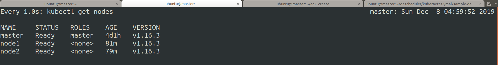
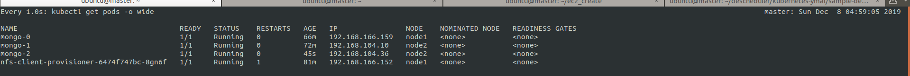
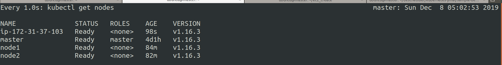
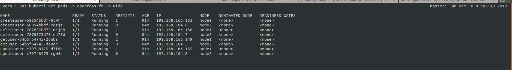
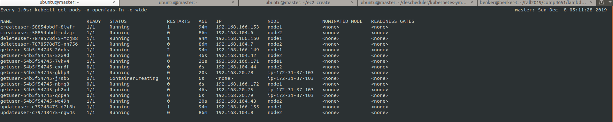
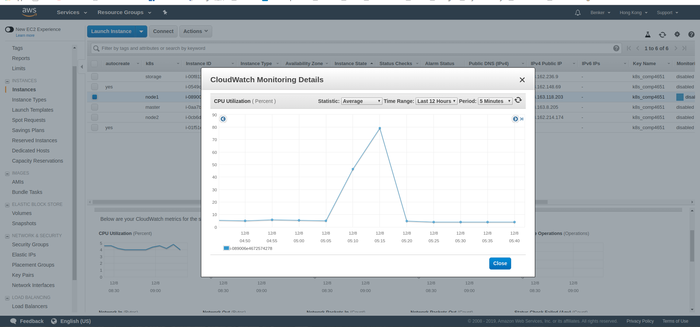
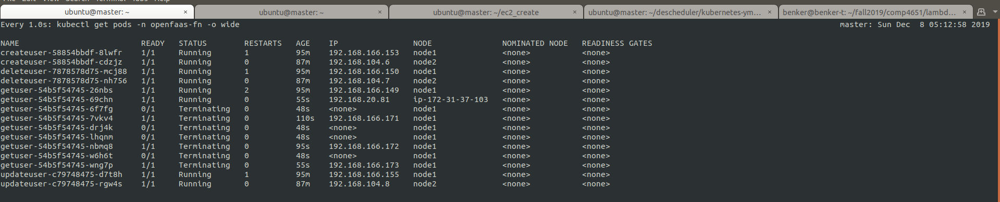
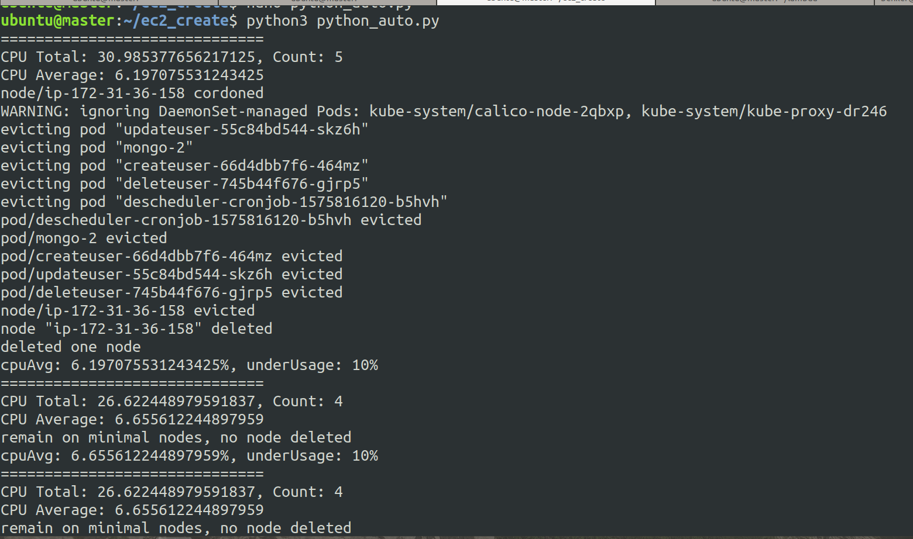

# Demo of auto scaling in kubernetes cluster
---

### Pod balancing
* __Node info originally__
The screenshot shows that there exist 1 master node, and 2 slave nodes.

* __Pod info originally__
The screenshot shows that the __1__ mongo instance in __node1__ and __2__ mongo instances in __node2__

* __Node info after one node added__
The screenshot shows that slave node __ip-172-31-37-103__ is added to the cluster

* __Pod info after one node added__
The screenshot shows that every node has a mongo instance in this case, which is achieved by evicting one mongo pod in __node2__ by the [descheduler](https://github.com/kubernetes-sigs/descheduler)

---

### Auto scaling of pods
* __Pod info before scaling up__
The screenshot shows that number of pods during no request, since min set to 2, so at least two pod per function

* __Pod info after scaling up__
The screenshot shows that number of pods after a script is called, which request the function once per 0.1 seconds.

* __CPU stat from EC2 dashboard__
The screenshot shows one of the slave node's CPU utilization during the high request time.

* __Pod info after stopping high request script__
The screenshot shows that many pods are being terminated because the request rate is dropping, so no need to maintain too many pods at that time.

---

### Auto scaling of Slave nodes

* __Log Output__
The first block the log shows that the CPU average is 6.19%, which is under 10%, so considered as under usage, then a slave nodes is removed and that EC2 instance is terminated.

Similarly, if the CPU usage is over certain threshold, then an EC2 instance will be created and join the cluster.